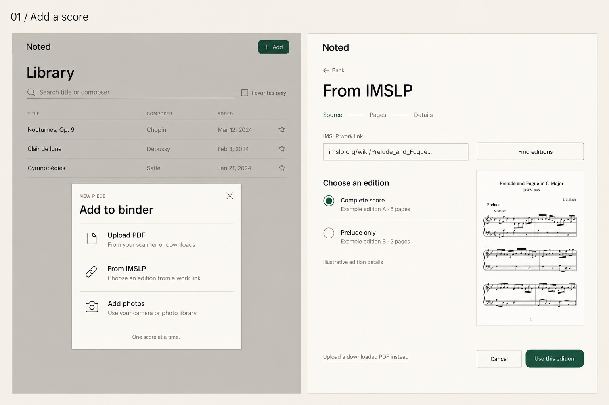
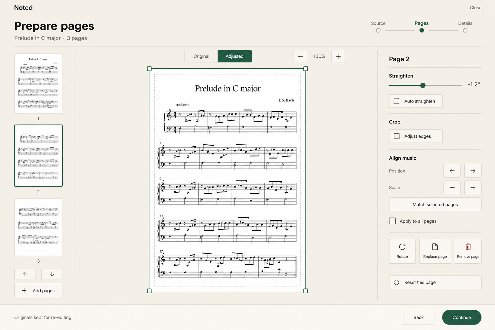
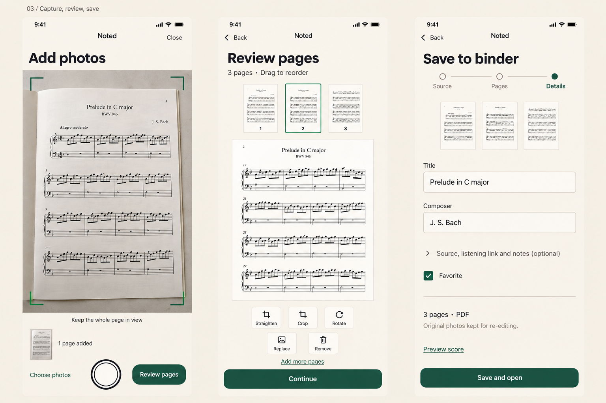

# Score intake concepts, version one

Status: Proposed for user review. These are generated image mockups, not screenshots
of implemented features. Created 2026-09-13 with the built-in image generation tool.

[Implementation proposal](../../../product/score-intake-improvements-plan.md)
sets mockup acceptance as the first checkpoint before application implementation.
[Exact generation prompts](prompts.json) are recorded in image order.

## 1. Add a score and select an IMSLP edition

The existing Add piece action opens Upload PDF, From IMSLP, and Add photos choices.
The IMSLP flow makes edition selection explicit and keeps an upload fallback visible.
The library backdrop is illustrative; retain the current library's actual row fields,
Listen, favorite, and edit actions during implementation.

## 2. Prepare pages on iPad or desktop

Page thumbnails, a large score preview, and a compact adjustment panel support
straightening, crop, and alignment of printed music. Compare with the original,
reset a page, or apply an adjustment to selected pages. Alignment must preserve
notation at the edges. This is a preparation screen, separate from the reader.

## 3. Capture, review, and save on a phone

Capture successive pages, inspect or replace an individual page, and confirm score
details. The camera illustration represents the desired flow; actual browser camera
behavior needs physical-device evaluation before implementation choices are settled.
Page ordering also needs button controls, even though this concept emphasizes drag.

## Review notes

The three boards show related example states, not one source file with a fixed page
count. Edition labels and page counts are illustrative, and the generated notation
must never be used as a musical source or a test fixture.

The intended theme follows `../../design-tokens.md` and `../../visual-direction.md`.
Exact typography, color values, primary pill shapes, 44px targets, accessibility, and
responsive behavior will need verification in the later implemented UI. Mockups do
not establish browser support, working IMSLP access, or correction quality.

The review should settle the source chooser, initial cleanup controls, bulk alignment
behavior, and phone layout. No application implementation is included in this pass.
