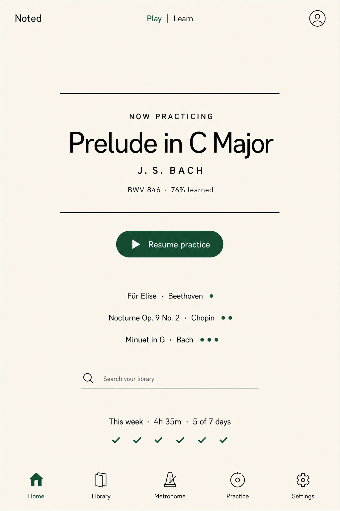

# Noted Binder Visual Direction

Status: Accepted “Title Page” direction adapted for the digital binder
Last updated: 2026-07-23

## Baseline

The selected visual baseline remains the version-two “Title Page” concept:

The binder carries forward its ivory paper, ink typography, forest-green accent,
hairline rules, typographic hierarchy, and absence of card chrome. The baseline
sets the visual language, not the archived dashboard information architecture.

## Library

- The Library is the first screen and the product’s primary working surface.
- “Noted” is a quiet wordmark; “Library” is the page’s strongest type.
- Search by title or composer is prominent and underlined rather than boxed.
- Favorites are a compact filter next to search.
- Pieces are hairline-separated rows, not covers or cards.
- Each row prioritizes title, composer, and page count (shown in the document
  mark). When a listening URL exists, a labeled 44px-minimum Listen action opens
  it in a new tab without activating the row.
- Add is the single green pill action. Favorite and Edit details are quiet line
  icons with accessible labels; page editing and PDF download are reached from
  the details dialog. Unfinished drafts appear as rows above the pieces with a
  Resume button.
- Metadata and PDF upload use one square-edged modal with a bordered drop zone.
- The Prepare flow shares the Library's masthead, page width, and button system.
  Its numbered Source, Pages, Details steps are the only numbered element in the
  product because they are a real sequence.

## Reader

- The reader is an immersive `100dvh` route with a dark neutral surround and a
  white PDF page. The actual score is the visual asset.
- A safe-area-aware top bar holds back, title/composer, and page position.
- The top bar and compact dark toolbar auto-hide after three seconds of true
  inactivity. Score taps and genuine fine-pointer movement then reveal only a
  circular, 44px-minimum controls bubble above the lower-right safe area.
  Activating the bubble opens both bars; activity inside them resets the hide
  timer. Scrolling, touch-panning, and auto-scroll motion leave them hidden.
- The full toolbar floats above the bottom safe area and wraps into stable rows
  on narrow phones. The bubble is absent while the toolbar is open, so the two
  affordances never overlap.
- Page mode uses left/right tap zones, horizontal swipes, and keyboard/pedal
  input. Auto-scroll mode uses a green play/pause control, speed slider, and
  zoom controls.
- Forest green indicates the active mode and primary action. There is no in-app
  or synchronized reference audio playback, playback cursor, notation
  highlighting, annotation entry, or practice UI.
- Auto-scroll pages retain clear gaps and render only near the viewport.

## Responsive behavior

- Primary touch targets are at least 44px.
- The target is a 13-inch iPad in portrait, with desktop and phone layouts also
  remaining complete and non-overlapping.
- The library search/filter row stacks on phones.
- Reader controls may wrap but must never hide a required control off-screen.
- Safe-area insets are applied to the reader bars, modal footer, and page shell.

## Excluded visual patterns

- No dashboards, weekly metrics, practice progress, bottom navigation, or
  intermediate piece-detail page.
- No decorative sheet music, cover-art grid, gradient illustration, or floating
  page-section cards.
- No shadows in the library. Modals use a border and raised paper tone.
- No eyebrow or overline labels above headings, no uppercase interface text, no
  numbered markers on parallel choices, and no middle-dot-joined metadata
  strings. Words in the interface are sentences or short labels.
