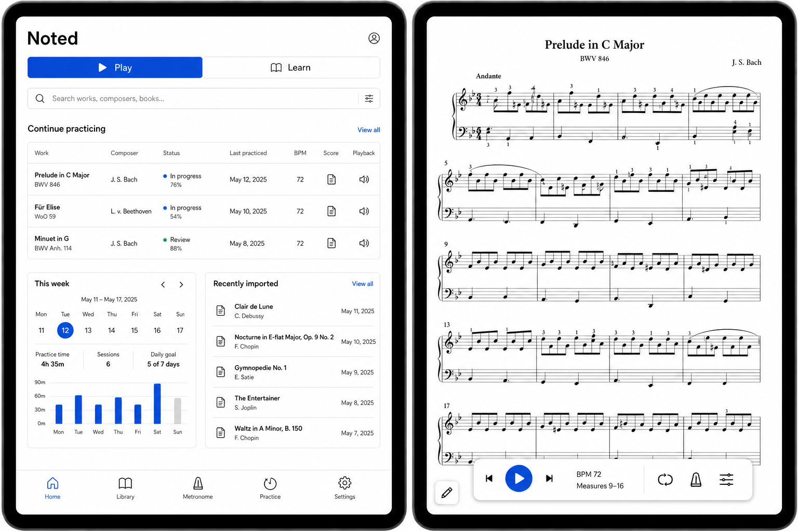
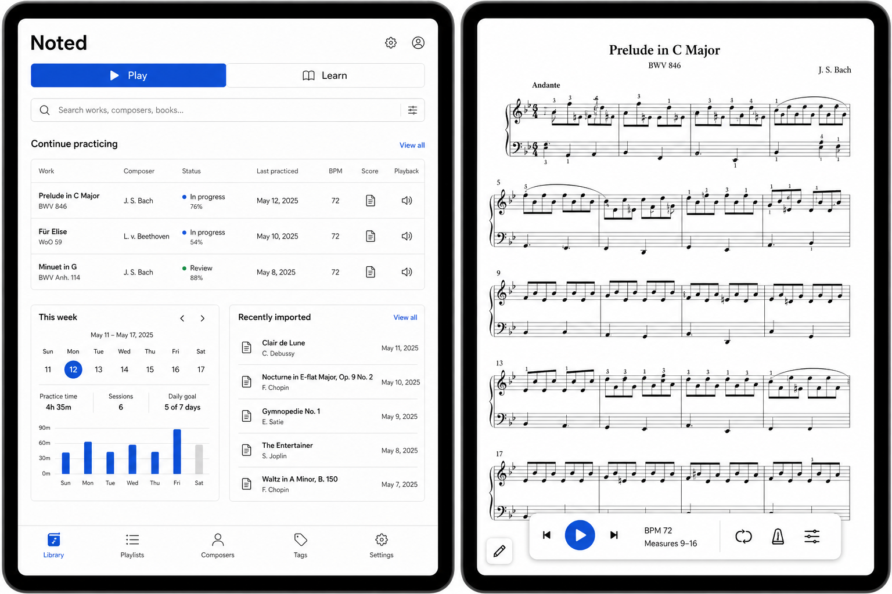

# Noted: Visual Direction

Status: Version-one direction selected
Last updated: 2026-07-13

## Version-one visual baseline

The following refined concept is accepted as the visual baseline for the first version:

It establishes the intended palette, spacing, typography, navigation, dashboard hierarchy, and score-player character. It does not lock exact dimensions, data fields, icons, or interaction behavior; those will be validated through functional wireframes and implementation.

## Selected baseline

The first generated concept—utilitarian black, white, and cobalt blue—is the current preferred direction.

Later generated refinements drifted too far from this baseline. Future visual edits should begin with the first concept and preserve its layout unless a specific element is being tested.

This is a direction-setting mockup rather than an approved screen design. Labels, navigation, data, proportions, and individual controls remain open to revision.

## Elements to preserve

- Clear, practical hierarchy.
- Predominantly white interface with black typography, crisp boundaries, and the selected cobalt-blue accent.
- A familiar mobile-app structure with recognizable icon-based bottom navigation.
- An information-rich dashboard that preserves generous whitespace and does not feel cramped.
- Prominent search.
- Current repertoire at the top of the dashboard so the learner can resume quickly.
- Repertoire presented as a table rather than a cover grid.
- Immediate visibility of recent practice and imports.
- Weekly practice metrics that can be understood at a glance.
- Score notation occupying nearly the entire reading surface.
- Compact floating playback controls.
- A separate, unobtrusive entry into annotation mode.
- Practical typography and hard-edged controls.

## Elements requiring reconsideration

- Bottom navigation includes Playlists, which is not a current requirement and should be removed.
- The final bottom-navigation destinations need to be chosen while preserving the familiar mobile-app feel.
- Work status and progress percentages have not yet been defined.
- The score reader needs explicit behavior for hiding and revealing controls.
- Measure-range selection and loop configuration in the playback bar need a clearer interaction design.
- The exact relationship among Library, dashboard, search, tags, composers, and settings needs an information-architecture pass.
- The mockup uses two landscape-style devices in the comparison board; the actual score experience must be validated specifically for a 13-inch iPad in portrait orientation.
- Weekly metrics must support a configurable week start or a clearly defined Monday default.

## Next design pass

The next iteration should retain the visual language while testing:

1. A simplified phase-one dashboard focused on resume, search, and recent imports.
2. A portrait score reader with both controls-hidden and controls-visible states.
3. An annotation-active state with only pencil and eraser.
4. A work-details screen showing the work, editions, score assets, source information, and learner status.

The immediate refinement will show dashboard and score player together and apply these interaction decisions:

- Bottom navigation: Home, Library, Metronome, Practice, Settings.
- Monday-first weekly metrics.
- Work-details-first behavior as the current hypothesis.
- Explicit Start Practice action.
- Measure numbers visible in structured scores.
- A single compact measure-range control, such as `Measures 9–16`. Tapping it opens a small popover containing only start and end measure numbers.
- A standalone pencil button in the lower-left corner enters markup mode, following familiar document-editing conventions.

An intermediate refinement proposed removing dashboard search and keeping search only in Library. The accepted baseline later restored the original dashboard search. For the POC, the dashboard field may delegate to the same Library search behavior; there is no separate Search navigation destination. The Metronome destination provides quick access to a basic metronome and its sound/configuration settings.

## Refinement feedback

- Dashboard and Library search should share one search behavior rather than become independent implementations.
- The center bottom-navigation destination should be Metronome rather than Search.
- The score player should use fewer visible controls and preserve more visual calm.
- The separate unexplained `m. 9` numeric control should be removed.
- Loop endpoints should not appear as two large Set Start/Set End buttons in the persistent bar.
- The compact playback bar should show the current range as `Measures #-#`; range editing is disclosed only after tapping it.
- The pencil should remain visually independent in the bottom-left corner rather than being absorbed into the playback bar.

## Baseline correction

The next accepted revision returns to the first concept and changes only:

- Weekly metrics begin on Monday.
- Bottom navigation is Home, Library, Metronome, Practice, Settings.
- The duplicate top-right settings gear is removed because Settings already exists in bottom navigation.
- The top-right account/profile control remains.

The original dashboard search, Play/Learn switch, Continue Practicing table, whitespace, metrics, recently imported list, score layout, floating playback bar, and independent lower-left pencil are preserved.

This correction was accepted as a good first-version direction on 2026-07-13.

## Current feature priority reflected in design

1. Store/find pieces and play them back.
2. Track practice and show useful weekly metrics.
3. Annotate scores.

Annotation entry should remain visible as a future-capable affordance, but it should not dominate the initial score-player design.
