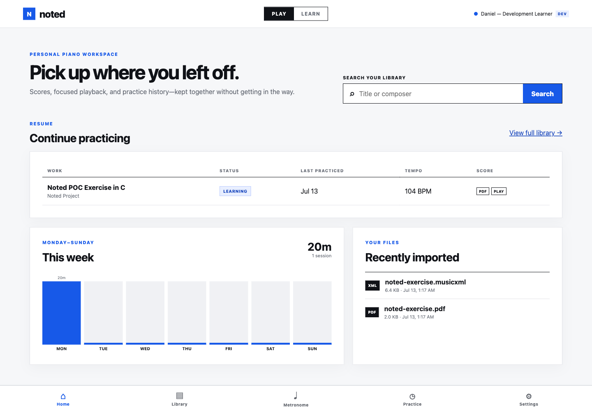
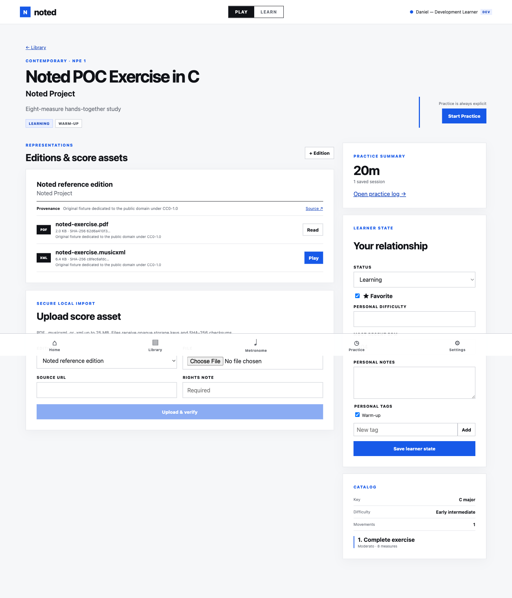
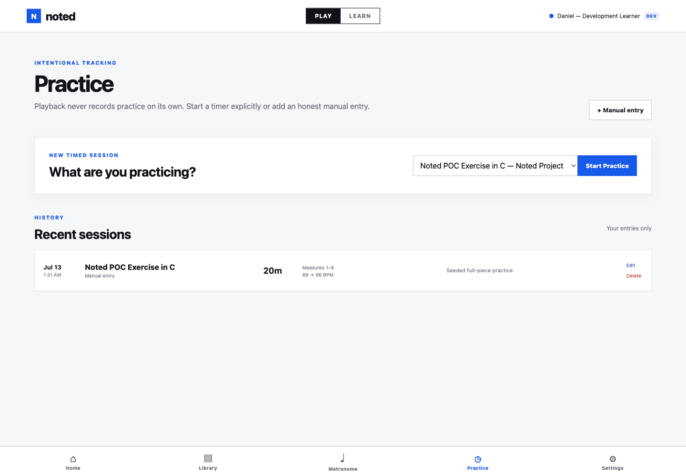
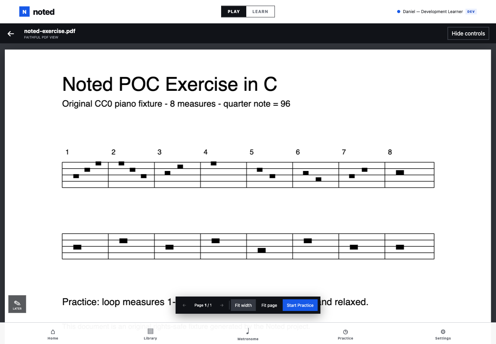
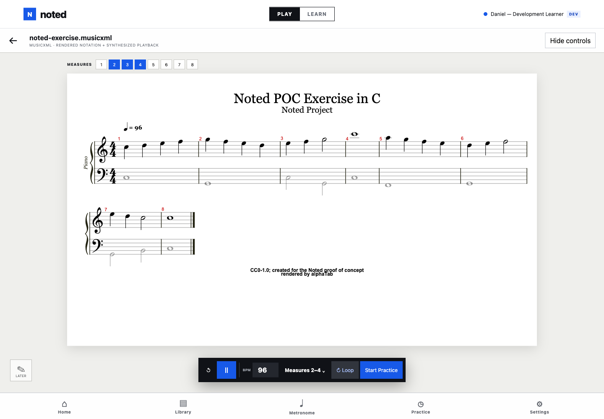
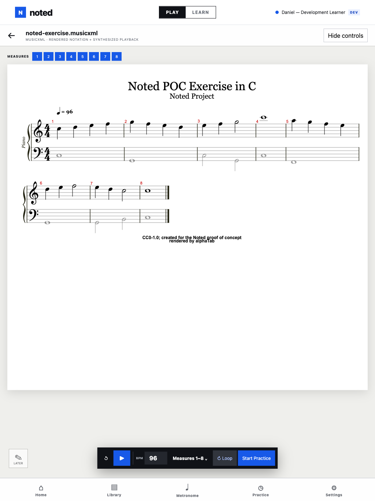

# Noted POC verification record

Status: Passed
Date: 2026-07-15
Branch: `codex/poc-player-followups`

## Requirement traceability

| POC requirements | Implementation evidence | Automated/manual evidence |
|---|---|---|
| POC-001–004 | Angular shell, five destinations, disabled Learn mode, responsive cobalt visual system | `app.spec.ts`; desktop Chrome and 1024×1366 WebKit E2E; responsive browser screenshots |
| POC-010–015 | Dashboard current works, capabilities, Monday-first metrics, recent imports, search-to-Library | `home.component.spec.ts`; Flow A and Flow C E2E |
| POC-020–026 | Work-level Library, query/status/favorite/tag filters, work details, learner-owned state/tags | `library.component.spec.ts`, `work-details.component.spec.ts`; ownership integration test |
| POC-030–037 | Edition-bound streaming upload, content sniffing, size limits, provenance/checksum metadata, storage interface, opaque keys, writable-storage readiness | staged-upload limit/cleanup handler tests, `TestDetectUploadValidatesExtensionAndContent`, store readiness tests, upload-cleanup and ownership integration tests; Flow B E2E |
| POC-040–043 | Authenticated PDF stream and lazy PDF.js adapter with navigation, fit modes, canvas identity, cleanup | Flow A in both E2E projects; real-browser PDF inspection |
| POC-050–058 | Lazy alphaTab adapter, eight visible master-bar identities, SoundFont playback, BPM/range/loop/restart, PDF-only capability state | range unit test, work-details capability test, Flow A E2E; real Chrome Play/Pause and measures 2–4 inspection |
| POC-059–059b | Route-metadata immersive shell, `100dvh` score surface, safe-area back action, three-second activity controls, applied/draft range separation, cobalt cursor/highlighting, reduced-motion cursor | app/player/adapter unit tests; Flow A in desktop Chrome and portrait WebKit; visible desktop and portrait browser inspection |
| POC-060–063 | Web Audio metronome, 30–240 BPM control, persisted learner preference and accent | TypeScript check plus real-browser UI inspection |
| POC-070–077 | Explicit durable timer, one-running-timer database constraint, retained timer context, discard recovery, complete manual entry/edit associations and timestamps, aggregate refresh | timer service and practice component tests, patch-presence/ownership/domain/weekly Go tests, Flow C E2E |
| POC-080–083 | Monday preference, metronome/about settings, visible development identity, fail-closed config/API startup | config tests and shell test; production configuration refusal reviewed in `cmd/api` |

## Automated results

Final commands were run from the repository root:

| Command | Result |
|---|---|
| `make test` | Passed: all Go packages including PostgreSQL integration tests and migration rollback/reapply; 9 Angular test files / 19 tests |
| `make lint` | Passed: gofmt check, `go vet ./...`, Prettier check, TypeScript no-emit check |
| `make build` | Passed: all Go packages and Angular production build; initial UI bundle 274.66 kB raw / 76.84 kB estimated transfer, score engines lazy-loaded |
| `make test-e2e` | Passed: 6/6 tests in dedicated database/asset storage, covering Flows A–C in installed desktop Chrome and WebKit at 1024×1366 portrait |
| isolated headed E2E | Passed: 6/6 tests visibly repeated in desktop Chrome at 1440×1000 and portrait WebKit at 1024×1366 |
| `npm audit` | Passed: 0 known vulnerabilities in the pinned dependency tree |

Backend coverage specifically includes practice patch presence semantics and historical timestamps, cross-user asset filtering, database-first deletion and storage failure handling, streamed-upload limits/cleanup, readiness write failures, domain/range validation, opaque path safety, UTC daily aggregation, Monday-first weeks, and fail-closed development authentication.

## Browser verification

- Desktop Chrome at 1440×1000: the MusicXML route filled the viewport without global chrome; controls hid and returned on score activity; the cobalt cursor advanced, froze on pause, restarted, and looped; the explicit Back action restored the application shell. PDF and MusicXML assets were reopened afterward.
- Practice browser pass: a timer was started and discarded through its confirmation; the complete manual form exposed start time, movement, score asset, measures, hand/part, BPM values, and notes; E2E created and corrected every optional field while retaining the original timestamp and associations.
- Portrait pass at 1024×1366: the immersive score player had no document-width overflow and retained its safe bottom controls. The headed WebKit project repeated all three core flows with touch/mobile settings.
- Reduced-motion emulation kept the position cursor while disabling its animated setting.
- Console result: no application errors. Chrome emits the expected deprecation warning for alphaTab's documented ScriptProcessor audio fallback; the reason and upgrade path are in ADR 0001.
- Physical iPad Safari was not available and is not claimed. Real-device audio unlock, interruption recovery, and long-score memory pressure remain the named follow-up.

Selected evidence:

| Dashboard | Work details | Practice summary |
|---|---|---|
|  |  |  |

| PDF reader | MusicXML score player | Portrait score player |
|---|---|---|
|  |  |  |

## Clean-checkout result

A detached worktree at the committed follow-up branch head was created with no dependency, build, configuration, or asset output. In that worktree:

1. `make setup` created `.env` and the local asset tree, downloaded Go modules, and completed `npm ci` with 0 vulnerabilities.
2. `make test`, `make lint`, `make build`, and `make test-e2e` all passed independently of the original working directory; the test command also rolled all migrations down and reapplied them.
3. The E2E wrapper created and removed its dedicated PostgreSQL database and temporary asset root without touching the normal development data.

The clean worktree was removed afterward. The final source review found no committed `.env`, credentials, browser state, database/runtime data, personal scores, `node_modules`, `.local` assets, Playwright output, or Angular/Go build output.

## Known limitations

The score-library tradeoffs and fallbacks are documented in [ADR 0001](../decisions/0001-browser-score-rendering-and-playback.md). Production OAuth, NFS/NAS storage, deployment, annotations, lessons, sharing, offline use, and performance assessment remain deferred as required. Audiveris OCR is specified separately in [ADR 0002](../decisions/0002-audiveris-ocr-pipeline.md) as a gated post-POC increment and is not claimed by this verification record.
